<div align="center">

# Passroute

### 🎤 실전같은 면접, 합격으로 가는 길

**Multi-Agent 기반 실시간 AI 면접 분석 플랫폼**

이력서·자소서를 근거로 질문을 만들고, **무엇을(내용)** · **어떻게(전달)** 말했는지 동시에 측정해
사실검증까지 담은 개인화 리포트를 자동으로 만들어 주는 취업 준비 플랫폼입니다.

<br/>


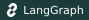


<sub>🎓 2026 동국대학교 캡스톤디자인 · <b>윤정이방팀</b> (4인) · 2026.03 ~ 2026.06</sub>

<br/>

[기능](#-핵심-기능) · [데모](#-데모--발표자료) · [아키텍처](#-시스템-아키텍처) · [멀티 에이전트](#-multi-agent-구조) · [기술적 도전](#-기술적-도전) · [실행](#-설치--실행) · [팀](#-팀원)

</div>

---

## 🧭 한눈에 보기

> 면접 준비의 본질적 어려움은 **"피드백 루프의 부재"** 입니다.
> 스터디·모의면접은 평가가 주관적이고, **내용**(논리·직무적합성)과 **전달**(말 속도·필러·시선)을 사람이 동시에 정량화하기 어렵습니다.
> Passroute는 이 문제를 **4개의 독립 서비스가 결합된 분산 아키텍처**로 풀었습니다.

|     | 서비스                 | 역할                                               | 핵심 기술                                     |
| :-: | :--------------------- | :------------------------------------------------- | :-------------------------------------------- |
| 🖥️  | **passroute-frontend** | 웹 클라이언트 · 실시간 미디어 캡처                 | Next.js 16 (App Router), React 19, TypeScript |
| ⚙️  | **passroute-backend**  | 도메인·세션 오케스트레이션 · 인증 · 영속화         | Spring Boot 3.3, Java 17, MySQL, Redis        |
| 🤖  | **passroute-ai**       | LLM Multi-Agent · STT · 표정 분석 · RAG            | FastAPI, GPT-4o, LangGraph, ChromaDB          |
| 🕷️  | **passroute-crawling** | 채용공고·뉴스·기술블로그 수집 (토론 주제·RAG 근거) | AWS SAM (Lambda), ChromaDB, KR-SBERT          |

<br/>

<div align="center">

**Passroute를 떠받치는 세 개의 기둥**

</div>

<table>
<tr>
<td width="33%" valign="top">

#### 1️⃣ 1:1 AI 기술/인성 면접

이력서·자소서·포트폴리오를 **RAG**로 활용해 면접관 페르소나가 질문을 생성하고, 답변에 따라 **꼬리질문**을 동적으로 만들며, 10개 평가축 + **STAR** + **사실검증**으로 채점합니다.

</td>
<td width="33%" valign="top">

#### 2️⃣ AI 토론 면접

**5종 AI 토론자 + 사회자**가 등장하는 상태기계 기반 턴제 토론. 사용자는 찬/반 입장을 맡고 AI는 반대편에서 입론·반론·최종변론을 수행하며, 매 턴이 평가됩니다.

</td>
<td width="33%" valign="top">

#### 3️⃣ 실시간 멀티모달 분석

브라우저 음성을 **16kHz PCM**으로 스트리밍해 STT로 WPM·필러·침묵을 측정하고, **MediaPipe**로 시선·눈깜빡임을 분석. 면접 중 **최악 15초 구간**을 자동 추출해 리포트에 첨부합니다.

</td>
</tr>
</table>

---

## 🎬 데모 & 발표자료

<div align="center">

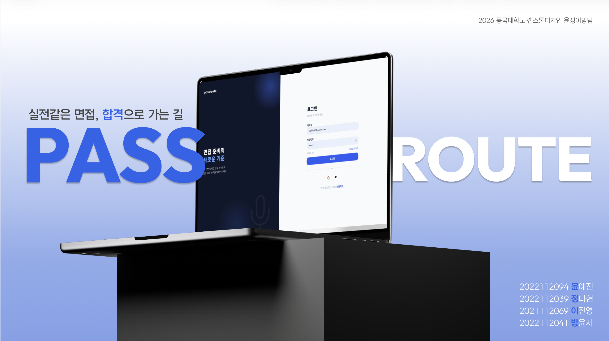

</div>

<br/>

### ✨ 기능 미리보기

<table>
  <tr>
    <td align="center" width="50%">
      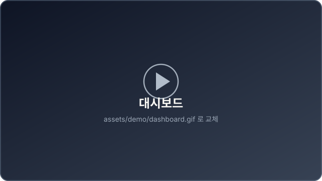<br/>
      <b>📊 대시보드</b><br/><sub>면접 현황 · 일정 · 성장 추이를 한 화면에</sub>
    </td>
    <td align="center" width="50%">
      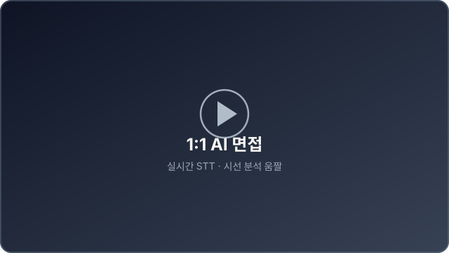<br/>
      <b>🎤 1:1 AI 면접</b><br/><sub>실시간 STT · 시선 오버레이 · 꼬리질문</sub>
    </td>
  </tr>
  <tr>
    <td align="center">
      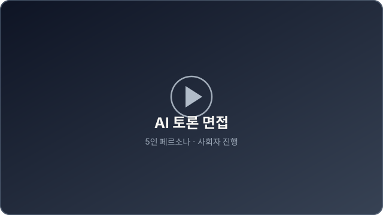<br/>
      <b>🗣️ AI 토론 면접</b><br/><sub>5인 페르소나 아바타 영상 · 사회자 진행</sub>
    </td>
    <td align="center">
      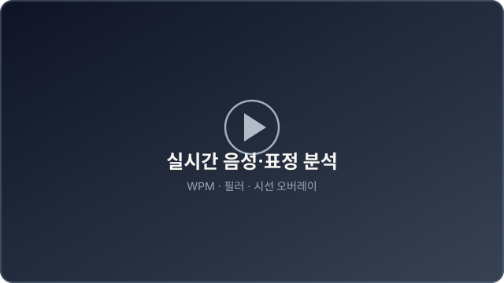<br/>
      <b>📡 실시간 음성·표정 분석</b><br/><sub>WPM · 필러 · 침묵 · 시선/눈깜빡임</sub>
    </td>
  </tr>
  <tr>
    <td align="center">
      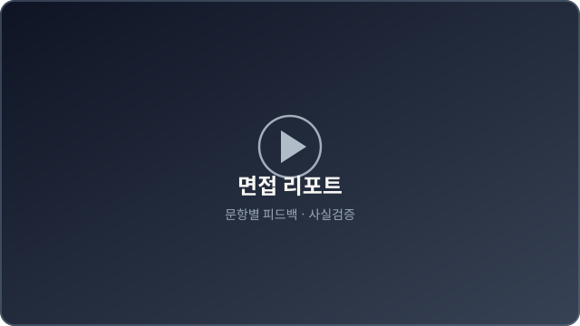<br/>
      <b>📝 면접 리포트</b><br/><sub>문항별 상세 피드백 + 사실검증</sub>
    </td>
    <td align="center">
      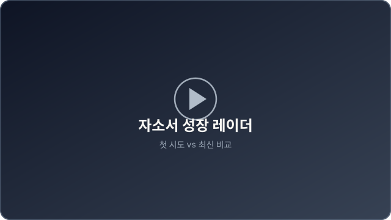<br/>
      <b>📈 자소서 성장 레이더</b><br/><sub>첫 시도 vs 최신, 축별 ▲▼ 델타</sub>
    </td>
  </tr>
  <tr>
    <td align="center">
      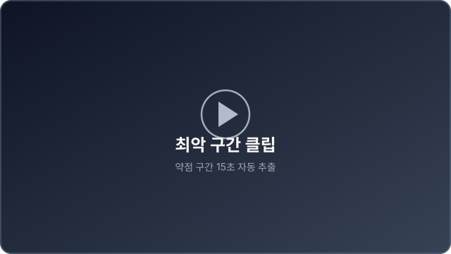<br/>
      <b>🎞️ 최악 구간 클립</b><br/><sub>약점 15초 구간 자동 추출 플레이어</sub>
    </td>
    <td align="center">
      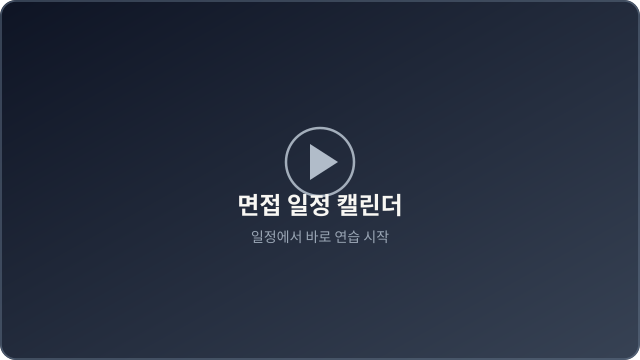<br/>
      <b>📅 면접 일정 캘린더</b><br/><sub>일정에서 바로 연습 시작</sub>
    </td>
  </tr>
</table>

---

## 🚀 핵심 기능

<details open>
<summary><b>📂 클릭해서 기능 전체 보기</b></summary>

### 🔐 인증 & 계정

- 이메일·비밀번호 회원가입 (**휴대폰 OTP**, CoolSMS), 로그인, **JWT 발급/재발급**
- 로그아웃 (Redis 블랙리스트), 이메일/비밀번호 찾기, **Kakao/Google 소셜 로그인**, 회원 탈퇴

### 📄 문서 & 자기소개서

- 이력서/포트폴리오 PDF **presigned URL 업로드** → 비동기 텍스트 추출(PDFBox) → AI 서버 **ChromaDB 적재**
- 대표 문서 지정/삭제, 자소서 항목 CRUD 및 자소서 단위 **종합 리포트**

### 🎤 1:1 AI 면접

- 면접방 설정/시작, **페르소나·슬라이더 기반 질문 생성**, 답변 제출, 동적 **꼬리질문**
- 답변별 **비동기 평가**, 세션 종료, **비동기 리포트**, 최악 클립 저장, **CS 토픽 분석**

### 🗣️ AI 토론 면접

- 뉴스 RAG 기반 **주제 추천/생성**, 페르소나 조회, 세션 생성/시작, 상태 폴링
- 턴 제출, 반론 분기(`rebut_again`/`finish`), 종료, 리포트, 최악 클립

### 📡 실시간 분석

- **WebSocket STT**(면접/토론), **표정/시선 분석**, 음성 지표(WPM·필러·침묵) 집계

### 📊 리포트 & 일정

- 면접/토론/자소서 단건 리포트, **통합 리스트**(페이지네이션), 예정 면접 요약, soft-delete
- 면접 일정 **캘린더 CRUD** + "일정에서 연습 시작"

</details>

---

## 🏗️ 시스템 아키텍처

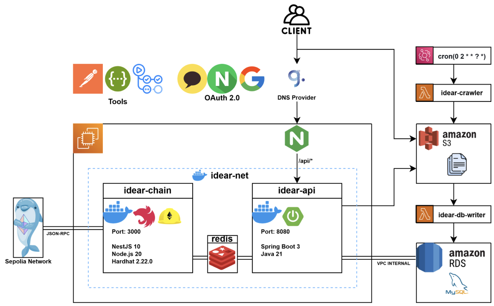

> **Frontend**는 일반 도메인 요청을 **Backend(REST)** 로, 실시간 신호(PCM/영상)는 **AI 서버로 직접 WebSocket** 연결합니다.
> **Backend**는 도메인·트랜잭션·인증의 단일 진실 원천이며 LLM 호출은 `AiServerClient`로 위임합니다.
> **Crawler**는 서버리스로 수집한 채용/뉴스/블로그를 ChromaDB에 임베딩 적재해 질문·토론 주제의 RAG 근거가 됩니다.

<details>
<summary><b>🔄 1:1 면접 데이터 흐름 (클릭)</b></summary>

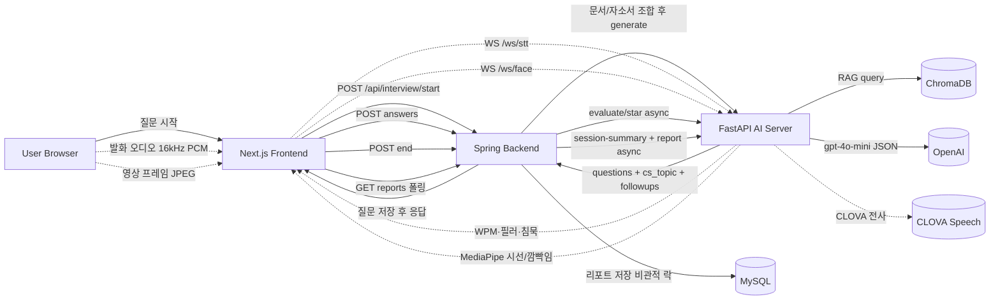

</details>

---

## 🤖 Multi-Agent 구조

면접관·토론자를 **역할이 분리된 다수의 LLM 에이전트**로 모델링하고, 작업 난이도에 따라 **모델 티어**(`gpt-4o` / `gpt-4o-mini`)와 전용 프롬프트를 분담시켰습니다.

| 에이전트                           | 역할                                                         |       모델        |
| :--------------------------------- | :----------------------------------------------------------- | :---------------: |
| **Question Generator**             | 문서 RAG 기반 면접 질문 생성                                 |   `gpt-4o-mini`   |
| **Follow-up (LangGraph)**          | `analyze → search → generate` 3노드 상태기계로 꼬리질문 생성 |   `gpt-4o-mini`   |
| **Evaluator / STAR**               | 10개 평가축 + STAR 구조 채점                                 | `gpt-4o` / `mini` |
| **Report + Fact-Check**            | 문항별 상세 피드백 + 사실검증 리포트                         |     `gpt-4o`      |
| **Debate Personas ×5 + Moderator** | 토론자 입론/반론/최종변론 + 사회자 진행                      | `gpt-4o` / `mini` |
| **Debate Turn Evaluator**          | 라운드별 활성 평가축 **가중치 재정규화** 동적 채점           |     `gpt-4o`      |

<div align="center">

#### 🎭 면접관 페르소나


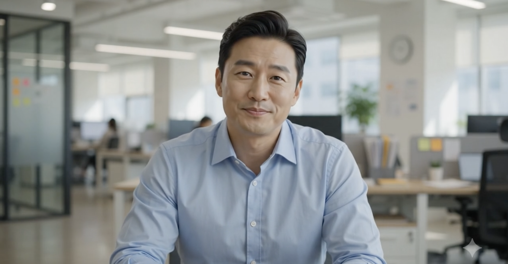
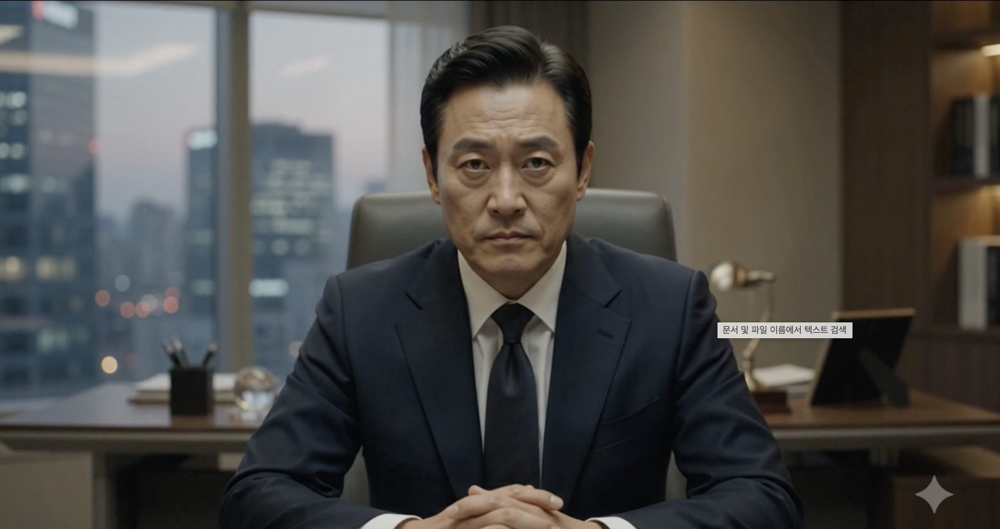
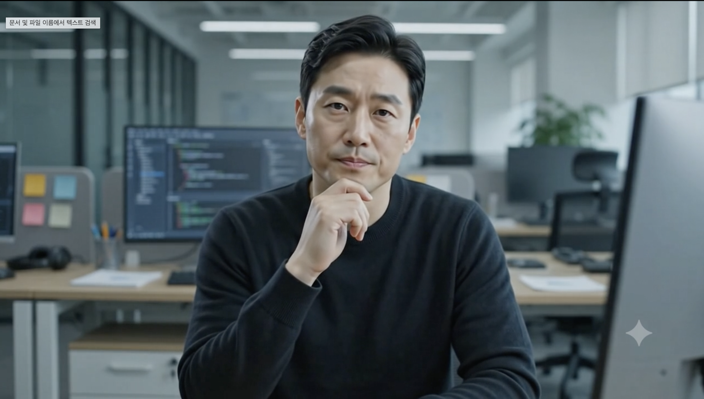

<sub>인사담당 · 팀장(실무) · 임원 · 기술 면접관</sub>

#### 🗣️ 토론자 페르소나


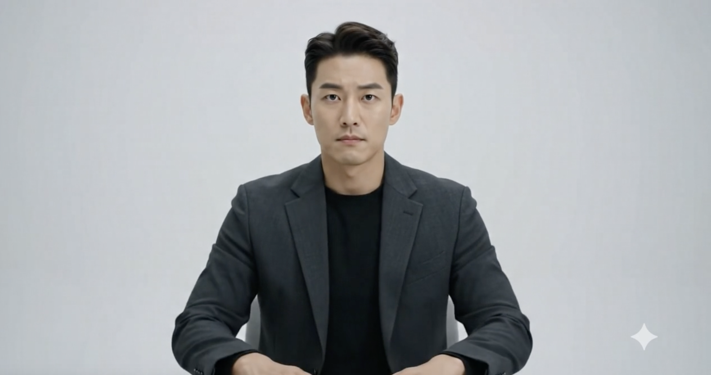

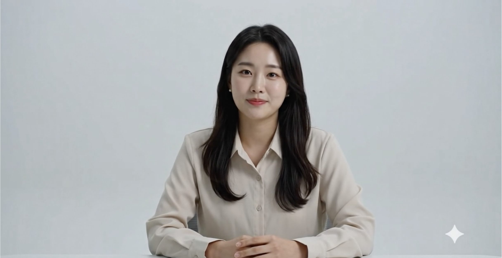
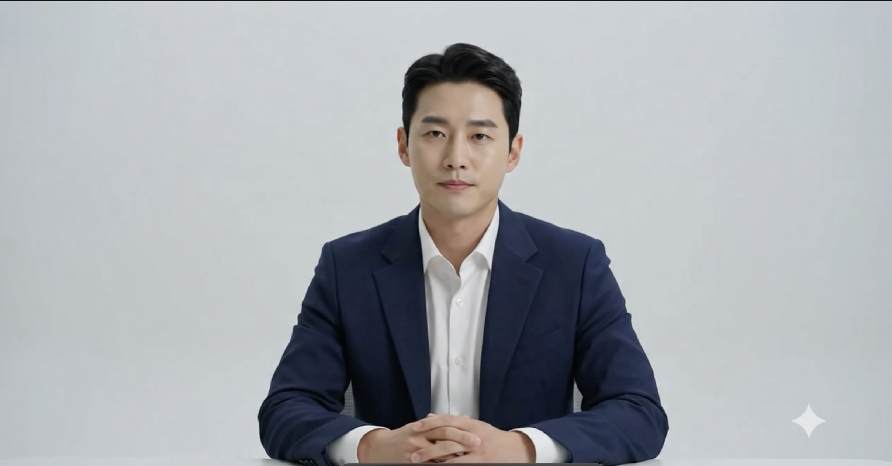

<sub>김지원 · 박도현 · 이서연 · 정하은 · 최태진</sub>

</div>

---

## 🛠️ 기술 스택

<table>
<tr><td><b>🖥️ Frontend</b></td><td>

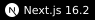


<sub>네이티브 MediaRecorder / getUserMedia / AudioWorklet / WebSocket</sub>

</td></tr>
<tr><td><b>⚙️ Backend</b></td><td>


<sub>JPA · OAuth2(Kakao/Google) · AWS S3(presigned) · RestClient · CoolSMS</sub>

</td></tr>
<tr><td><b>🤖 AI</b></td><td>


<sub>KR-SBERT(ONNX 양자화) · Naver CLOVA Speech · Google Cloud TTS / Vision OCR · webrtcvad</sub>

</td></tr>
<tr><td><b>🕷️ Crawling</b></td><td>


<sub>JobKorea 채용공고 · 네이버 뉴스 · 22개 기술블로그 · Cloud Vision OCR · CloudWatch→Discord 알림</sub>

</td></tr>
<tr><td><b>🧰 공통</b></td><td>


</td></tr>
</table>

---

## 🧩 기술적 도전

> 단일 모듈로는 풀 수 없는, **상호의존적 세부문제**들을 실제 코드 메커니즘으로 해결했습니다.

|   #    | 난제                                 | 해결                                                                                                                 |
| :----: | :----------------------------------- | :------------------------------------------------------------------------------------------------------------------- |
| **C1** | 비동기 리포트의 **동시성·중복** 생성 | `REQUIRES_NEW` + `saveAndFlush` 멱등 시작, 유니크 제약 위반 포착으로 중복 스킵, 리포트 쓰기는 **비관적 락**으로 보호 |
| **C2** | 토론 세션 **상태 경합**              | `@Version` **낙관적 락** + 상태 전이·pending-STT 소비를 단일 `saveSession`으로 묶어 락 충돌 방지                     |
| **C3** | LLM 출력의 **비결정성·부분 손상**    | 필드 단위 **방어적 파싱** — 손상 항목만 폐기하고 리포트 생성 지속                                                    |
| **C4** | AI 서버 **장애 격리**                | best-effort 호출 + 재시도/백오프, 실패 시 폴백으로 **graceful degradation**                                          |
| **C5** | 실시간 STT **지연·정확도**           | `AudioWorklet` 16kHz PCM 변환 + `webrtcvad` 침묵 게이팅 + 15초 슬라이딩 윈도 WPM                                     |
| **C6** | 토론 **라운드별 평가축 가변성**      | 활성 필드 게이팅 + **가중치 재정규화** 동적 채점                                                                     |
| **C7** | **이미지형 채용공고(JD)** 처리       | 이미지 JD 감지 → Cloud Vision OCR → 노이즈 제거 → 임베딩                                                             |

---

## 📁 레포지토리 구성

본 프로젝트는 **4개의 독립 레포지토리**로 운영됩니다. (org: [`yoonjungeeroom`](https://github.com/yoonjungeeroom))

| 레포                                                                          | 설명                                            |
| :---------------------------------------------------------------------------- | :---------------------------------------------- |
| 🖥️ [passroute-frontend](https://github.com/yoonjungeeroom/passroute-frontend) | Next.js 웹 클라이언트 · 실시간 미디어 캡처      |
| ⚙️ [passroute-backend](https://github.com/yoonjungeeroom/passroute-backend)   | Spring Boot 도메인·인증·세션 오케스트레이션     |
| 🤖 [passroute-ai](https://github.com/yoonjungeeroom/passroute-ai)             | FastAPI LLM Multi-Agent · STT · 표정 분석 · RAG |
| 🕷️ [passroute-crawling](https://github.com/yoonjungeeroom/passroute-crawling) | AWS SAM 서버리스 데이터 수집 파이프라인         |

<details>
<summary><b>📂 클릭해서 디렉토리 구조 보기</b></summary>

```bash
passroute/
├── frontend/                 # Next.js 16 (App Router)
│   ├── app/                  # 페이지: interview · debate · reports · dashboard · schedule ...
│   ├── components/           # dashboard · reports · ui(shadcn)
│   ├── hooks/                # 실시간 엔진: use-stt · use-debate-stt · use-face-analysis · use-clip-recorder
│   ├── lib/api/              # API client + 리소스 모듈
│   └── public/               # 로고 · 페르소나 이미지 · audio-worklet
│
├── backend/                  # Spring Boot 3.3 / Java 17
│   └── src/main/java/.../    # auth · user · document · selfintro · interview · debate · report · schedule · global
│       └── db.migration/     # Flyway V1 / V2
│
├── ai/                       # FastAPI / Python 3.12
│   └── app/
│       ├── routers/          # questions · follow_up · evaluation · debate · resume · stt(WS) · face(WS) · voice
│       ├── services/         # LLM · STT · 표정 · 임베더 ...
│       ├── prompts/debate/   # 역할별 프롬프트(SYSTEM/USER 분리)
│       └── docs/evaluation/  # 루브릭 · 점수 정책 · JSON 스키마
│
└── crawling/                 # AWS SAM (Lambda 3.11)
    └── src/
        ├── app.py            # 5개 Lambda 핸들러
        ├── crawler/          # JobKorea
        ├── collector/        # naver_news · tech_blog
        ├── storage/          # s3 · chromadb
        └── consumer/         # EC2 → ChromaDB 적재
```

</details>

---

## ⚡ 설치 & 실행

각 레포를 클론한 뒤, 서비스별로 실행합니다. (`.env` 는 각 레포의 `.env.example` 참고)

<details open>
<summary><b>🖥️ Frontend</b></summary>

```bash
cd frontend
pnpm install
pnpm dev            # http://localhost:3000
```

</details>

<details>
<summary><b>⚙️ Backend</b></summary>

```bash
cd backend
docker compose up -d        # app + redis
# 또는 로컬 실행
./gradlew bootRun
```

</details>

<details>
<summary><b>🤖 AI Server</b></summary>

```bash
cd ai
docker compose up -d        # ai + redis (빌드 시 KR-SBERT ONNX 양자화 · MediaPipe 모델 다운로드)
# 또는 로컬 실행
pip install -r requirements.txt
uvicorn app.main:app --reload --port 8000
```

</details>

<details>
<summary><b>🕷️ Crawling</b></summary>

```bash
cd crawling
sam build --use-container
sam deploy --guided
```

</details>

---

## 👥 팀원

<table align="center">
  <tr>
    <td align="center">
      <a href="https://github.com/yezanee"></a><br/>
      <b>윤예진</b><br/>
      <a href="https://github.com/yezanee">@yezanee</a><br/>
    </td>
    <td align="center">
      <a href="https://github.com/dahyyun"></a><br/>
      <b>정다현</b><br/>
      <a href="https://github.com/dahyyun">@dahyyun</a><br/>
    </td>
        <td align="center">
      <a href="https://github.com/julianyeong"></a><br/>
      <b>이진영</b><br/>
      <a href="https://github.com/julianyeong">@julianyeong</a><br/>
    </td>
    <td align="center">
      <a href="https://github.com/rownmom"></a><br/>
      <b>방윤지</b><br/>
      <a href="https://github.com/rownmom">@rownmom</a><br/>
    </td>
  </tr>
</table>

|                           이름                            | 역할                                       | 담당 영역                                                                                                                      |
| :-------------------------------------------------------: | :----------------------------------------- | :----------------------------------------------------------------------------------------------------------------------------- |
|     **윤예진** [@yezanee](https://github.com/yezanee)     | 크롤러 오너 · 실시간 STT/표정 · DevOps     | **SQS/DLQ 인프라**·Discord 알림, blog_embedding OOM 분할, WebSocket STT·얼굴 분석 연동, MediaPipe Tasks API 마이그레이션       |
|     **정다현** [@dahyyun](https://github.com/dahyyun)     | AI 평가/리포트 · 토론 풀스택               | 문항별 피드백 구조화·점수-톤 프롬프트, fact-check 방어적 파싱, 토론 리포트 연동, 면접 리포트 상세 렌더, **자소서 성장 레이더** |
| **이진영** [@julianyeong](https://github.com/julianyeong) | 백엔드 코어 · AI 리소스 파이프라인 · CI/CD | **토론 페르소나 영상 서명·연동**, 이력서/포트폴리오 **ChromaDB·벡터검색 질문생성 연동**, TTS 기반 면접관 영상 전환             |
|     **방윤지** [@rownmom](https://github.com/rownmom)     | 프론트 실시간 UI · CS토픽                  | 1:1/토론 실시간 화면, **최악 클립 레코더**, 사전 점검, AI **음성·표정 분석 라우터**, CS 토픽 태깅·분석 API                     |

---

<div align="center">

**Passroute** · Multi-Agent 기반 실시간 AI 면접 분석 플랫폼

<sub>2026 동국대학교 캡스톤디자인 · Made with by <b>윤정이방팀</b></sub>

</div>
